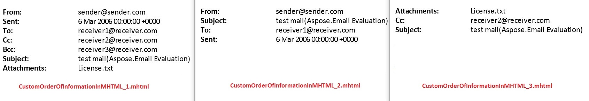

## **Track Document Conversion Progress**

Aspose.Email provides the facility to track the document conversion progress. For this, the API provides [SaveOptions.CustomProgressHandler](https://reference.aspose.com/email/net/aspose.email/saveoptions/customprogresshandler/). which represents the method that handles the progress events. The progress event types are represented by the [ProgressEventType](https://reference.aspose.com/email/net/aspose.email/progresseventtype/) enumeration. The [ProgressEventType](https://reference.aspose.com/email/net/aspose.email/progresseventtype/) enumeration has the following members.

- MimeStructureCreated: This event informs that the mime structure is created.
- MimePartSaved: This event informs that saving of one mime part is finished.
- SavedToStream: This event informs that all mime parts are saved to stream.

The following sample code demonstrates the use of [SaveOptions.CustomProgressHandler](https://reference.aspose.com/email/net/aspose.email/saveoptions/customprogresshandler/) and [ProgressEventType](https://reference.aspose.com/email/net/aspose.email/progresseventtype/) enumeration track the document conversion progress.



The following is the code for the custom class used in the code sample given above.



## **Render Hyperlinks with Custom Styles**

There may be times when you need to output hyperlinks with some specific style based on the requirements of your application. For that, Aspose.Email provides [HyperlinkRenderingCallback](https://reference.aspose.com/email/net/aspose.email/hyperlinkrenderingcallback/). You can pass the [HyperlinkRenderingCallback](https://reference.aspose.com/email/net/aspose.email/hyperlinkrenderingcallback/) as a parameter of [MailMessage.GetHtmlBodyText](https://reference.aspose.com/email/net/aspose.email/mailmessage/gethtmlbodytext/#gethtmlbodytext).

The following code snippet shows you how to use [HyperlinkRenderingCallback](https://reference.aspose.com/email/net/aspose.email/hyperlinkrenderingcallback/) to output hyperlinks using your own custom style.



{} 

RenderHyperlinkWithHref and RenderHyperlinkWithoutHref methods are intended to demonstrate hyperlink rendering and are not intended for production use.

{}

## **Display Information in Custom Order in MHTML Files**

Aspose.Email provides [MhtSaveOptions.RenderingHeaders](https://reference.aspose.com/email/net/aspose.email/headersformattingoptions/renderingheaders/) property which returns the list of headers for rendering. You can add the headers by using the [MhtTemplateName](https://reference.aspose.com/email/net/aspose.email/mhttemplatename/) class. The order in which the headers are added decides the order in which the information is displayed.

The following image compares the three outputs generated by the sample code.



The following code snippet demonstrates the use of [MhtSaveOptions.RenderingHeaders](https://reference.aspose.com/email/net/aspose.email/headersformattingoptions/renderingheaders/) property to set the order in which the information is displayed in the output MHTML files.



## **Display Optional Attendees in MHT Files**

When working with the MHT format, you can display or hide information about optional attendees in the header of calendar events. To configure [MhtSaveOptions](https://reference.aspose.com/email/net/aspose.email/mhtsaveoptions/) for MHT files handling, you need to understand how the [MhtFormatOptions.RenderCalendarEvent](https://reference.aspose.com/email/net/aspose.email/mhtformatoptions/) and [MhtFormatOptions.WriteHeader](https://reference.aspose.com/email/net/aspose.email/mhtformatoptions/) parameters work in customizing the output according to your needs, particularly when managing the display of optional attendees.

- **MhtFormatOptions.RenderCalendarEvent**: This parameter controls whether details of calendar events are rendered in the MHT file. By setting this option, you ensure that comprehensive event information, including attendee details, is included in the output. This is essential for providing complete documentation of calendar events.

- **MhtFormatOptions.WriteHeader**: This parameter determines if headers containing metadata such as subject, date, and participant information (including optional attendees, when configured) are written into the MHT file. Enabling this option ensures that contextually relevant information accompanies your message, enhancing understandability.

The code sample below demonstrates how to use *display optional attendees* feature when saving an msg in mhtml format:

```cs
MhtSaveOptions options = new MhtSaveOptions()
{
    MhtFormatOptions = MhtFormatOptions.RenderCalendarEvent | MhtFormatOptions.WriteHeader
};

MailMessage eml = MailMessage.Load(fileName);
eml.Save(fileName + ".mhtml", options);
```

If you need to exclude information about optional attendees from the MHT file, simply clear the format template for OptionalAttendees before saving:

```cs
//if you need to skip OptionalAttendees in mhtml file you can clear format template for OptionalAttendees
options.FormatTemplates[MhtTemplateName.OptionalAttendees] = "";
msg.Save(fileName + "2.mhtml", options);
```

## **Save All Headers in MHTML**

The [MhtSaveOptions.SaveAllHeaders](https://reference.aspose.com/email/net/aspose.email/mhtsaveoptions/saveallheaders/#mhtsaveoptionssaveallheaders-property) property of the [MhtSaveOptions](https://reference.aspose.com/email/net/aspose.email/mhtsaveoptions/#mhtsaveoptions-class) class defines whether there is a need to save all headers in output mhtml or not. The following code snippet shows you how to save all headers of an mhtml file:

```cs
var eml = MailMessage.Load("message.eml");
var sopt = SaveOptions.DefaultMhtml;
sopt.SaveAllHeaders = true;
eml.Save("message.mhtml", sopt);
```

## **Processing Bounced Messages**

It is very common that a message sent to a recipient may bounce for any reason such as an invalid recipient address. Aspose.Email API has the capability to process such a message for checking if it is a bounced email or a regular email message. The [CheckBounced](https://reference.aspose.com/email/net/aspose.email/mailmessage/checkbounced/#checkbounced) method of the [MailMessage](https://reference.aspose.com/email/net/aspose.email/mailmessage/) class returns a valid result if the email message is a bounced email. This article shows the usage of the [BounceResult](https://reference.aspose.com/email/net/aspose.email.bounce/bounceresult/) class that provides the capability of checking if a message is a bounced email. It further gives detailed information about the recipients, action taken and the reason for the notification. The following code snippet shows you how to process bounced messages.



## **Bayesian Spam Analyzer**

Aspose.Email provides email filtering using a Bayesian spam analyzer. It provides the [SpamAnalyzer](https://reference.aspose.com/email/net/aspose.email.antispam/spamanalyzer/) class for this purpose. This article shows how to train the filter to distinguish between spam and regular emails based on the words database.



## **Obtain Preamble and Epilogue from EML Messages**

An email message may contain some hidden information as a plain text before the message body (i.e. preamble) or after the body (i.e. epilogue). It is typically some additional information or context to the recipient before or after they read the main content of the email. You can obtain this information using [MailMessage.Preamble](https://reference.aspose.com/email/net/aspose.email/mailmessage/preamble/) or/and [MailMessage.Epilogue](https://reference.aspose.com/email/net/aspose.email/mailmessage/epilogue/#mailmessageepilogue-property) properties respectively. 

The following code snippet shows how to obtain the preamble and epilogue texts:

```cs
// Gets or sets a preamble text.
public string Preamble

// Gets or sets an epilogue text.
public string Epilogue
```

## **Email Tracking using MDN and Read Receipts**

Aspose.Email API provides support of email tracking using Message Disposition Notification (MDN). This is achieved by requesting the read receipts and creating the required information. The [MailMessage.ReadReceiptTo](https://reference.aspose.com/email/net/aspose.email/mailmessage/readreceiptto/) property gets or sets the set read receipt address. The [CreateReadReceipt](https://reference.aspose.com/email/net/aspose.email/mailmessage/createreadreceipt/) and [ReadReceiptRequested](https://reference.aspose.com/email/net/aspose.email.mapi/mapimessage/readreceiptrequested/) methods are used for creating and retrieving the information whether read receipts are requested. The following code snippet shows you how to email track using Aspose.Email API.


