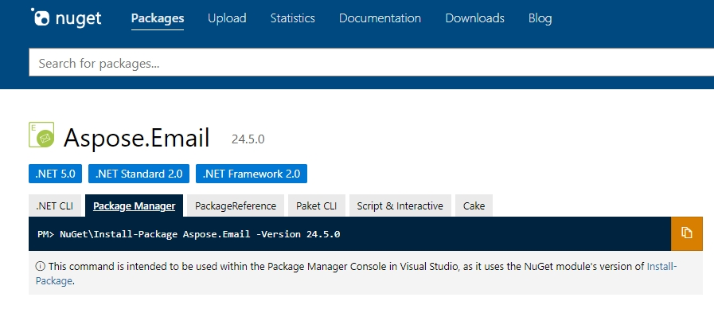
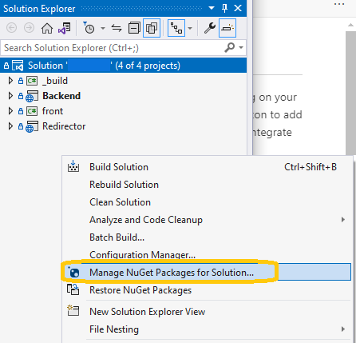
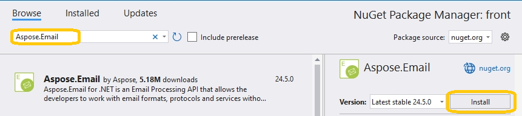
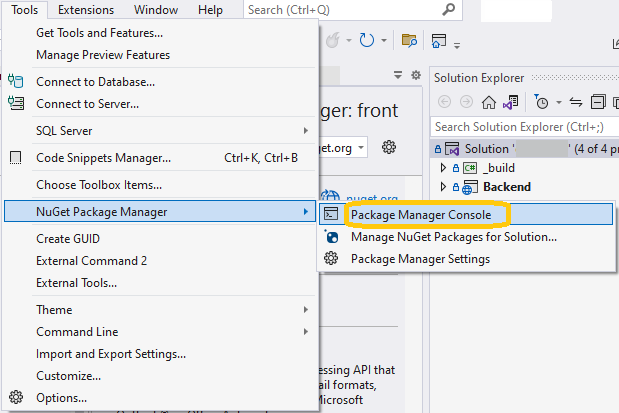
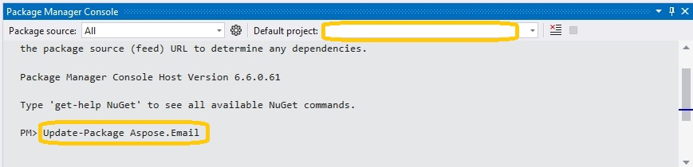

## **Installing Aspose.Email for .NET through NuGet**
NuGet is the easiest way to download and install [Aspose APIs](https://www.nuget.org/packages/Aspose.Email) for .NET.




## **Using the NuGet Package Manager GUI** 

1. Open your Visual Studio project and navigate to the "Manage NuGet Packages" option by right-clicking on your project in the Solution Explorer. 



2. In the NuGet Package Manager, search for "Aspose.Email" in the Browse tab. 
3. Once you locate the Aspose.Email package, click the "Install" button to add it to your project. 



## **Using the Package Manager Console**

You can easily download and integrate the Aspose.Email library into your project, allowing the access to its comprehensive email management features, by running the command 'Install-Package Aspose.Email' in the Package Manager Console. 

1. Open your solution/project in Visual Studio.
2. Select **Tools** -> **NuGet Package Manager** -> **Package Manager Console**.
3. Type the command 'Install-Package Aspose.Email' and press Enter.

NuGet ensures that you get the latest version of the package, including all current updates and hotfixes. 


## **Update Aspose.Email using the Package Manager Console**
You can update Aspose.Email using the Package Manager Console in Visual Studio:

1. Open your solution/project in Visual Studio.
2. Select Tools -> NuGet Package Manager -> Package Manager Console.



3. In the console, ensure the correct project is selected in the "Default project" dropdown. Next, execute the command Update-Package Aspose.Email to fetch and install the latest version of the Aspose.Email library. This command will update the package and its dependencies to the newest version, ensuring your project has the most current features and improvements offered by Aspose.Email. 

Alternatively, you can add the "**-prerelease**" suffix to the command in order to specify that the latest release including hot fixes is to be installed as well.

 


## **Install Aspose.Email for .NET on Linux**

For installing the library via .NET CLI on any platform, including Linux:

1. Open a Terminal. Ensure you have the .NET SDK installed on your machine. You can verify this by running:

  ```bash
  dotnet --version
  ```

2. Create a New Project. Navigate to the directory where you want to create the project and run dotnet new command. For example:

  ```bash
  dotnet new console -n AsposeEmailApp
  ```

  This will create a new directory called MyConsoleApp with the necessary files for a console application.

3. Navigate to the Project Directory.

  ```bash
  cd AsposeEmailApp
  ```
  
4. Add the Aspose.Email Package. Use the dotnet add package command to add Aspose.Email from NuGet:

  ```bash
  dotnet add package Aspose.Email
  ```
By following these steps, you will download and install the latest version of Aspose.Email for .NET from NuGet and add it to your project dependencies. After the installation is complete, you can use the library in your .NET project on Linux.
